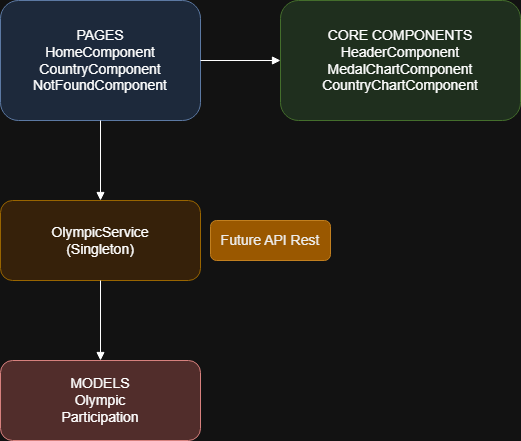

# ARCHITECTURE.md

# Architecture Front-End -- Télésport (Jeux Olympiques)

## 1. Objectif

Cette architecture vise à :

- Séparer clairement les responsabilités (données / logique / affichage)
- Centraliser l'accès aux données
- Rendre le projet modulaire et évolutif
- Préparer l'intégration future d'une API back-end réelle

Les données sont actuellement simulées via un fichier JSON local.
L'architecture permet de basculer vers une API REST sans modifier les composants d'affichage.

---

## 2. Architecture

### 2.1 Arborescence du projet

  src/app/
    ├── core/
    │   ├── services/
    │   │   └── olympic.service.ts
    │   ├── models/
    │   │   ├── olympic.model.ts
    │   │   └── participation.model.ts
    │   ├── components/
    │   │   ├── header/
    │   │   ├── medal-chart/
    │   │   └── country-chart/
    │   └── app.constants.ts
    ├── pages/
    │   ├── home/
    │   ├── country/
    │   └── not-found/
    └── app.component.ts

### 2.2 Schema

---

## 3. Organisation des dossiers

### 3.1 core/

Le dossier `core/` contient les éléments partagés à toute l'application.

#### services/

Contient `olympic.service.ts`.

**Rôle :**

- Centraliser tous les accès aux données
- Encapsuler les appels HTTP
- Fournir les méthodes :
  - `getOlympics()`
  - `getCountryByName()`

Le service est fourni en `root`, ce qui en fait un **Singleton**.

---

#### models/

Contient les interfaces :

- `Olympic`
- `Participation`

**Rôle :**

- Assurer un typage strict
- Supprimer les `any`
- Sécuriser les manipulations de données

---

#### components/

Contient les composants réutilisables, indépendants du routing.

##### HeaderComponent

Affiche :

- Le titre global de l'application
- Le titre spécifique de la page
- Les indicateurs (KPI)

##### MedalChartComponent

Affiche le graphique "pie" du Dashboard
Reçoit les données via `@Input()`

##### CountryChartComponent

Affiche le graphique "line" d'évolution des médailles
Reçoit les données via `@Input()`

---

#### app.constants.ts

Contient les constantes globales (ex : nom de l'application).

---

### 3.2 pages/

Les composants dans `pages/` sont des **composants conteneurs liés au routing**.
Ils regroupent :

- L'appel au service
- Le calcul des données
- Le passage des données aux composants enfants

---

#### HomeComponent

Appelle `OlympicService`
Calcule : - Nombre total de pays - Nombre total de JO - Totaux de médailles
Passe les données à `MedalChartComponent`

---

#### CountryComponent

Appele `OlympicService`
Calcule : - Participations - Total médailles - Total athlètes
Passe les données à `CountryChartComponent`
Gére les eventuelles erreurs redirections
Permet de revenir en arrière

---

#### NotFoundComponent

Gère les routes invalides ou les pays inexistants.

---

## 4. Séparation des responsabilités

Couche Rôle

---

Service Accès aux données
Models Typage
Pages Organisation
Components Affichage

---

## 5. Préparation à une API Back-End

Actuellement, les données proviennent d'un fichier JSON local.
Grâce à la nouvelle architecture, seul `olympic.service.ts` devra être modifié pour pointer vers une API REST.
Le front-end est déjà prêt pour une intégration back-end, les pages et composants d'affichage resteront inchangés.
